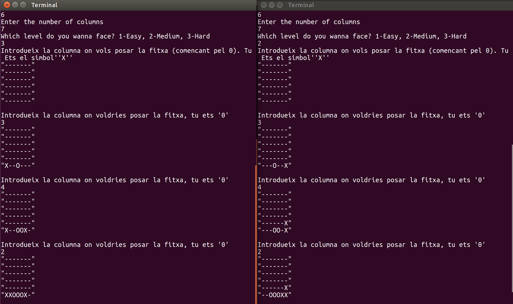

# 4 en Ratlla

En aquesta pràctica de LP, realitzarem un programa amb Haskell que jugui interactivament contra el participant al 4 en ratlla

## Anar començant

Les seguents instruccions et diran com executar el programa.

### Prerequisits

Només necessites el compilador ghc per compilar codi Haskell. També necessites la llibreria System.Random

En cas que no tingueu instalat el ghc:

```bash
sudo apt install ghc
```
I per instal·lar la llibreria Random

```bash
sudo apt install cabal-install
cabal update
cabal install random
```

### Compilar

Per compilar només cal fer a la línia de comandes

```
ghc joc.hs
```

```
./joc
```

## Com jugar


### Entrada

Simulació de l'entrada del joc.

```
Enter the number of rows
6
Enter the number of columns
7
Which level do you wanna face? 1-Easy, 2-Medium, 3-Hard
2
```

## Desenvolupament

Aquí mostraré com actua el meu algoritme en els diferents nivells. Així com una descripció de com funcionen els diferents nivells.
-  **Nivell 1**: L'ordinador simplement selecciona una columna de manera Random.


* **Nivell 2**: L'ordinador segueix una estratègia greedy. Això significa que sempre busca maximitzar el número de fitxes consecutives que podria colocar i decideix la columna en base a aquest raonament.
Concretament el que fa és simular que posa una fitxa per cadascuna de la columna i mira per cada fitxa posada en cada columa, quantes fitxes consecutives tindria, i es queda amb la columna que dongui el màxim.<br/>
Per a realitzar aquest procés ens ajudem de la funcio greedy. Aquesta funció el que fa es:
Mira si el Participant pot fer-ne 4 seguides en el pròxim torn, en cas que si, intentem evitar-ho, sense tenir en compte maximitzar les nostres fitxes. En cas que no, posem la fitxa a la columna que maximitzarà el nombre de fitxes Participant que podem tenir.<br/>
Aquesta estrategia presenta certes mancances ja que no es capaç de preveure moviments pròxims del contrari que el portaran a perdre, ja que molts cops actuar "greedilment" ens porta a mínims locals i no globals. <br/>Un clar exemple es que la simple sequencia del Participant 3-4-2-1 guanya.(Veure la dreta la foto). 
 La seqüència 3-4-2-1 ens garanteix guanyar sempre ja que l'Ordinador no ha sigut capaç de veure que després de que el Participant entrés un 4 hauria d'haver tancat un dels dos costats i no intentar posar una fitxa sobre on ja n'havia posat abans per maximitzar el seu nombre).<br/>

* **Nivell 3**: El que fem es és intentar anar més profundament en les possibles combinacions que el participant pot fer i actuar en conseqüència. En el meu cas he decidit seguir una estratègia min-max. Això significa que per decidir la columna on posaré la fitxa el que faig és simular què passaria en 2 nivells de profunditat si poses la fitxa en cada columna.<br/>
És a dir, simulo que l'Ordinador posa la fitxa a cada columna, a partir d'aquí miro cada possibilitat que pot posar el Participant, en aquest nou Tauler miro on posaria la fitxa l'Ordinador (actuant greedilment) i a partir d'aquí miro totes les possibilitats que pot fer el Participant.<br/>
Llavors el que faig és escollir la columna que em dongui el mínim màxim, és a dir, per cada columna inicial, he obtingut un conjunt de Taulers on cadascun després de que el Participant hagi jugat dos cops, tindrà un nombre de fitxes consecutives que ha aconseguit posar el Participant. De tots aquests, ens quedem amb el màxim possible. Això vol dir que ara tenim, per cada columna on l'Ordinador inicialment pot posar la seva fitxa, el nombre màxim de fitxes consecutives que el Participant et pot posar en dues jugades si jugues en aquella columna. El que fem dons, és escollir la columna tal que ens dongui el mínim sobre aquests màxima. Veiem com a la figura a l'esquerra <br/>

La seqüència 3-4-2-1 no és guanyadora ja que l'algoritme smart s'encarrega d'anar més a fons i escollir la millor opció.<br/>
Cal remarcar que abans del minmax, mirem si hi ha alguna opció del Participant que pugui fer-ne 4 en la pròxima jugada ja que podria passar que la solució del minmax(la que ens dóna millor resposta a 2 turnos vista) no contemplés que hi ha una altra opció que ens guanyarà immediatament.


## Construit Amb:

* [Haskell](https://www.haskell.org/)

## Autors

* **Jordi Bosch**

## Gràcies

* Als professors de LP